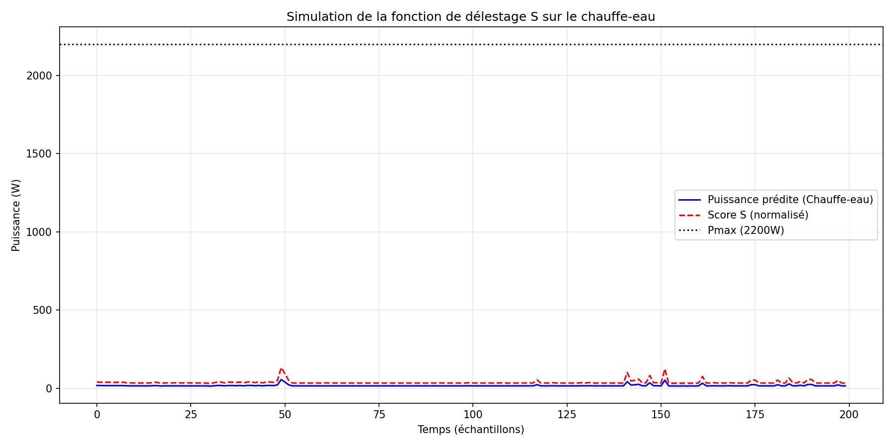

Hybrid NILM System for Smart Load Shedding

 1 Overview

This project presents a hybrid NILM (Non-Intrusive Load Monitoring) system combining **Random Forest** (statistical core) and **Symbolic Rules (Soft-Boost)** to disaggregate household electricity consumption from a single smart meter. It uses the public REFIT dataset and applies a multi-criteria cost function** 😊

 which appliances to shed.

The system was validated on **2 million lines** of REFIT data and simulated on **3 household profiles** using Proteus, demonstrating robustness and adaptability to low-resource contexts.

---

2 Key Features

- **Statistical Core** : Random Forest (non-linear) trained with gradient-based feature engineering (`Aggregate`, `Delta_P`, `Hour`).
- **Symbolic Layer** : Soft-Boost correction rules based on duration and power thresholds, applied only to relevant appliances (washing machine, water heater, kettle, microwave).
- **9-Appliance Recognition** : From refrigerators to washing machines, with MAE < 10 W for most appliances.
- **Optimisation-Driven Logic** : Multi-criteria cost function \( S \) balances financial cost, user comfort, grid safety, and appliance wear.
- **Proteus Simulation** : Three household profiles (4, 10, and 7 loads) with real-time load shedding.
- **Frugal Design** : Target cost < 10,000 FCFA (~15 €) for deployment in West African contexts.

---

### Dataset

- **Name** : REFIT Power Dataset (House 1)
- **Source** : Zenodo (open-access)
- **Size** : 383 MB — 6,960,008 rows at 15-second intervals
- **Structure** : `Aggregate` (total power) and `Appliance1` to `Appliance9` (individual loads)

---

### Methodology

1. **Feature Engineering** : Created `Delta_P` (power variation) and `Hour` (time context) from raw `Aggregate` data.
2. **Model Selection** : Compared Linear Regression and Random Forest. Random Forest was chosen for its ability to capture non-linearities and power spikes.
3. **Symbolic Correction (Soft-Boost)** : Applied progressive correction rules to specific appliances to fix under-estimations.
4. **Validation** : Trained on 100k, 500k, then 2 million rows to ensure robustness.
5. **Simulation** : Implemented in Proteus with 3 Arduino-based household models and a dynamic load-shedding algorithm.

---

### Results Summary

The hybrid model (Random Forest + Soft-Boost) was trained and validated on up to 2 million rows of the REFIT dataset. The results demonstrate clear improvements over pure linear regression, particularly on appliances with high power spikes.

**Water Heater** : The model achieved a Mean Absolute Error (MAE) of 28.78 W and an R² of 0.884, meaning that 88.4 % of the variance in water heater consumption is explained by the model. This represents a reduction of nearly 88 % in RMSE compared to the linear baseline.

**Washing Machine** : With an MAE of 7.78 W and an R² of 0.706, the model successfully captures the complex cycles of the washing machine (washing, spinning, rinsing). The RMSE was reduced by 72 % compared to pure linear regression.

**TV / Microwave** : The model achieved an MAE of 4.50 W and an R² of 0.246, with a 49 % reduction in RMSE. While the R² is modest (due to the appliance being off most of the time), the absolute error remains very low.

**Refrigerator** : The refrigerator remains a challenge due to its low and cyclic power signal (around 150 W). The MAE is 22.48 W, which is acceptable, but the R² is only 0.082, confirming that the model essentially predicts the average consumption rather than capturing individual cycles. This limitation is physical rather than algorithmic, as the refrigerator signal is often buried in the background noise of other appliances.

**Overall** : The hybrid approach proves robust and stable across all appliances. The symbolic layer (Soft-Boost) does not degrade performance and corrects under-estimations on power spikes. The system is now ready for deployment on a microcontroller (ESP32) with real-time load-shedding capabilities.Results obtained on 2 million rows of REFIT data with Random Forest + Soft-Boost.*

 Proteus Simulation

Three household profiles were simulated:
- **House 1 (Koffi)** : 4 loads, 10A subscription (2200 W max).
- **House 2 (Aïcha)** : 10 loads, 15A subscription (3300 W max).
- **House 3 (Moussa)** : 7 loads, 12A subscription (2640 W max).

Each Arduino reads the current, computes the cost function \( S \), selects the optimal action, and controls relays in real time. A buzzer alerts in critical situations.

*Simulation of the cost function S on the water heater.*

---

### Project Structure
